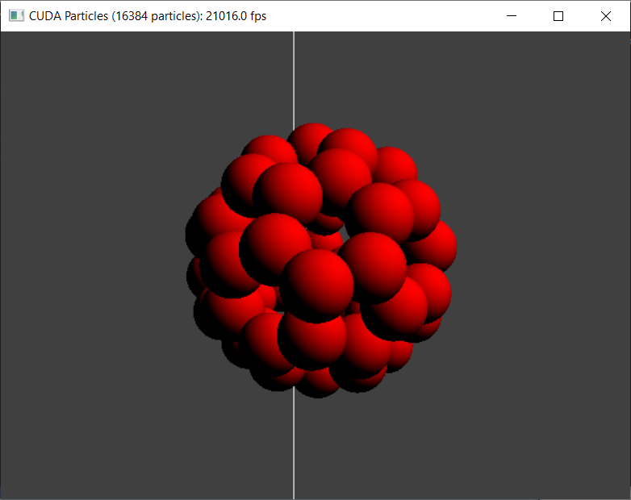

# nanostructures - Fullerene

## Description

This example implements inheritance from CUDA [particles](https://github.com/NVIDIA/cuda-samples/tree/master/Samples/2_Concepts_and_Techniques/particles) project. There are two additional structures: a hexagon and a fullerene loaded from a file.

## Build and Run

### Windows and Linux

- Download CUDA particles project.
- Add source files.
- Change a line in "particles.cpp"
```
ParticleSystem *psystem = 0;
```
to
```
NanoSystem* psystem = 0;
```
and a line
```
psystem = new ParticleSystem(numParticles, gridSize, bUseOpenGL);
```
to
```
psystem = new NanoSystem(numParticles, gridSize, bUseOpenGL);
```
- Follow the instructions to build and run.

## Screenshot


